###### 
 NscsUebung-001 

# 
 MIXED Routing 

# Ⅰ )
## 1 Main-Net (100) + Three Subnets (10,11,12) + DHCP, DNS & HTTP Server

  
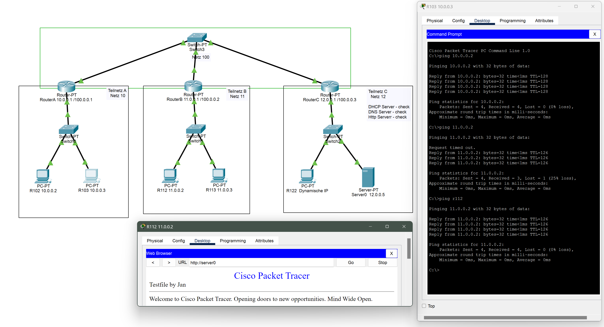

  
 click for details of Ⅰ 

 
---

# Ⅱ ) 
## Two static + One dynamic Network

---

  
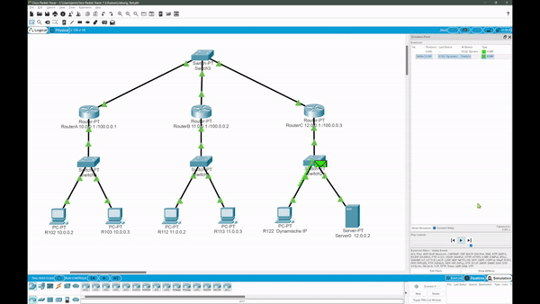

---

  

    click for details of Ⅱ
  

  
# IP-config - Tabs:

- ## R102:
  > 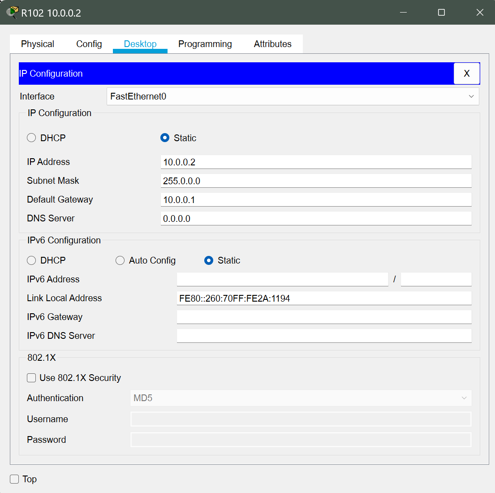

- ## R103:
  > 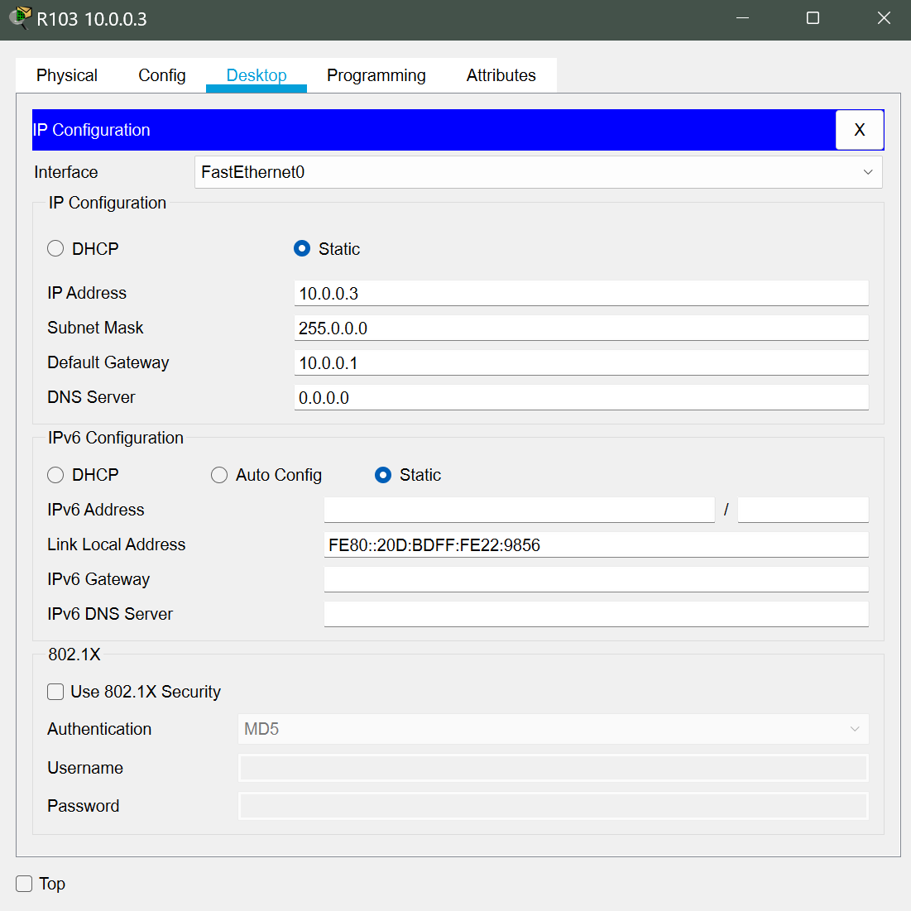

- ## R112:
  > 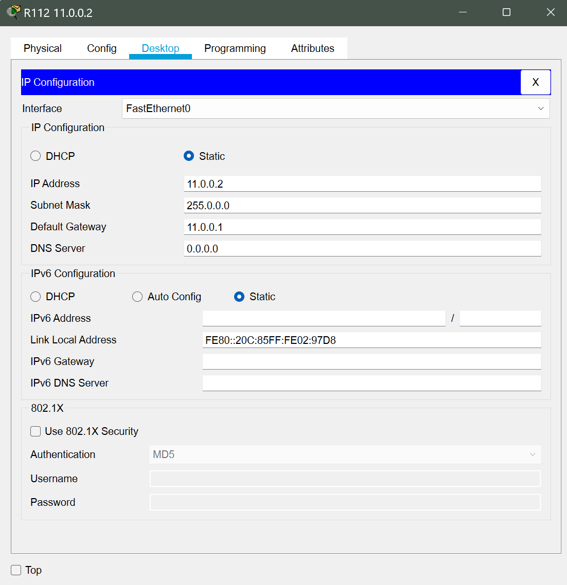

- ## R113:
  > 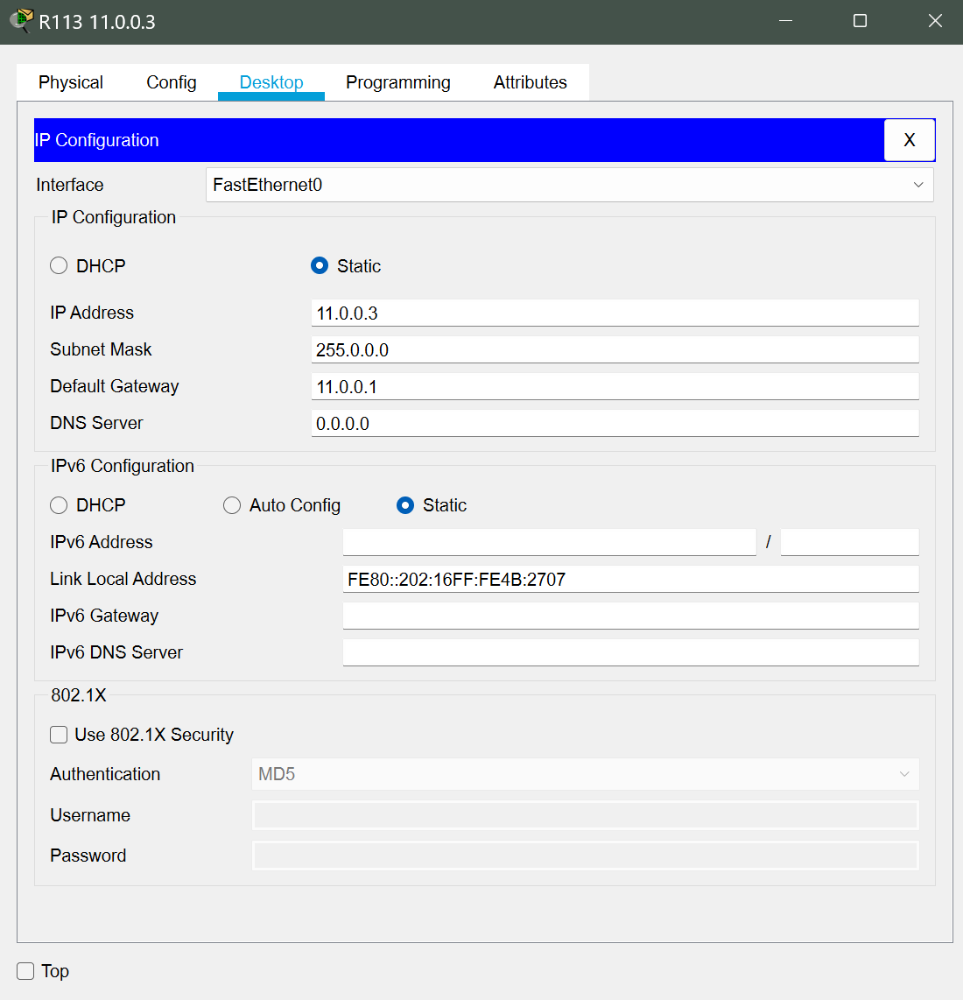

- ## R122:
  > 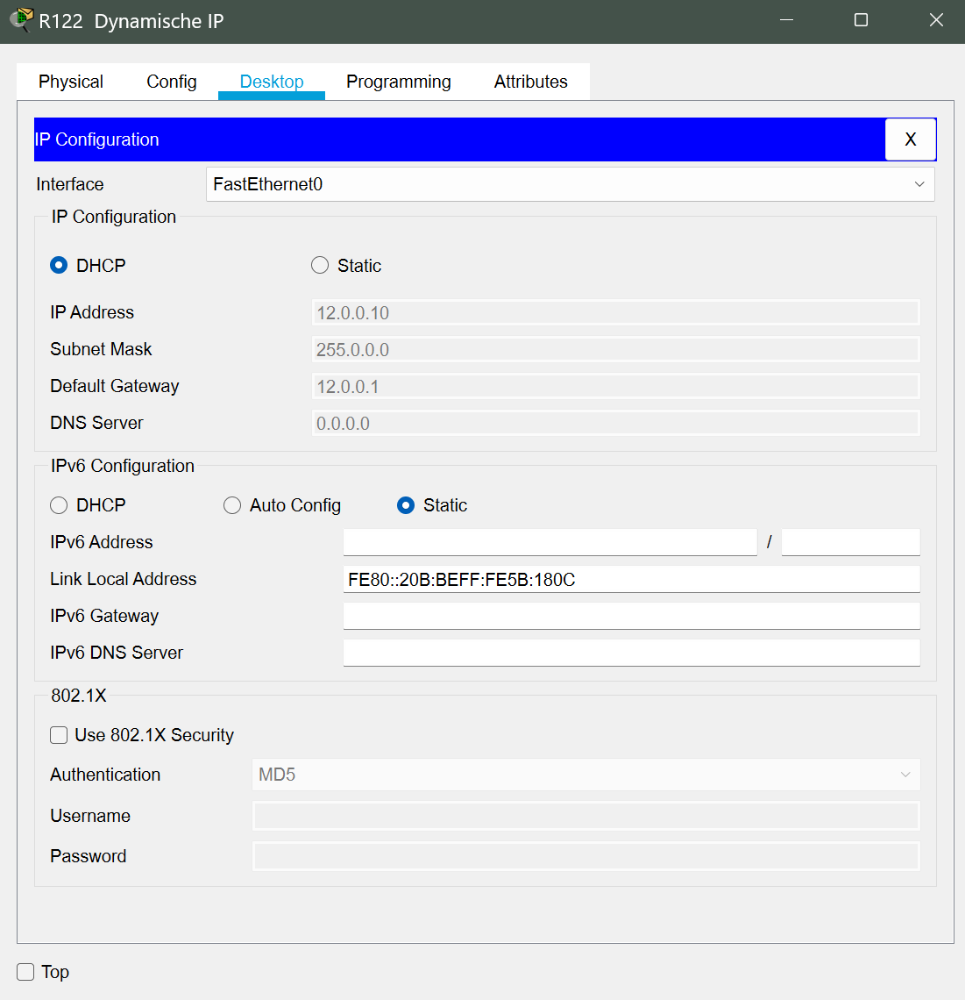

- ## DHCP Server:
  > 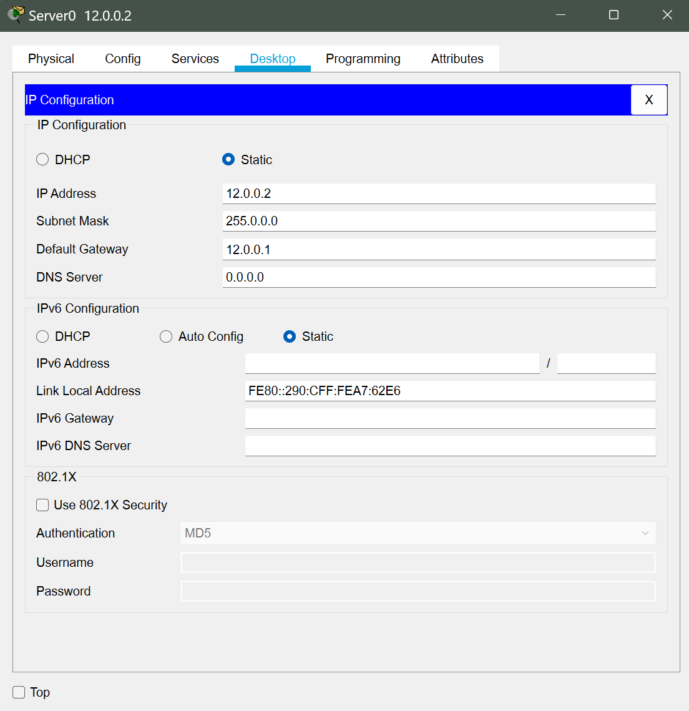

---
# Port - Forwarding:

- ## RouterA:
  > 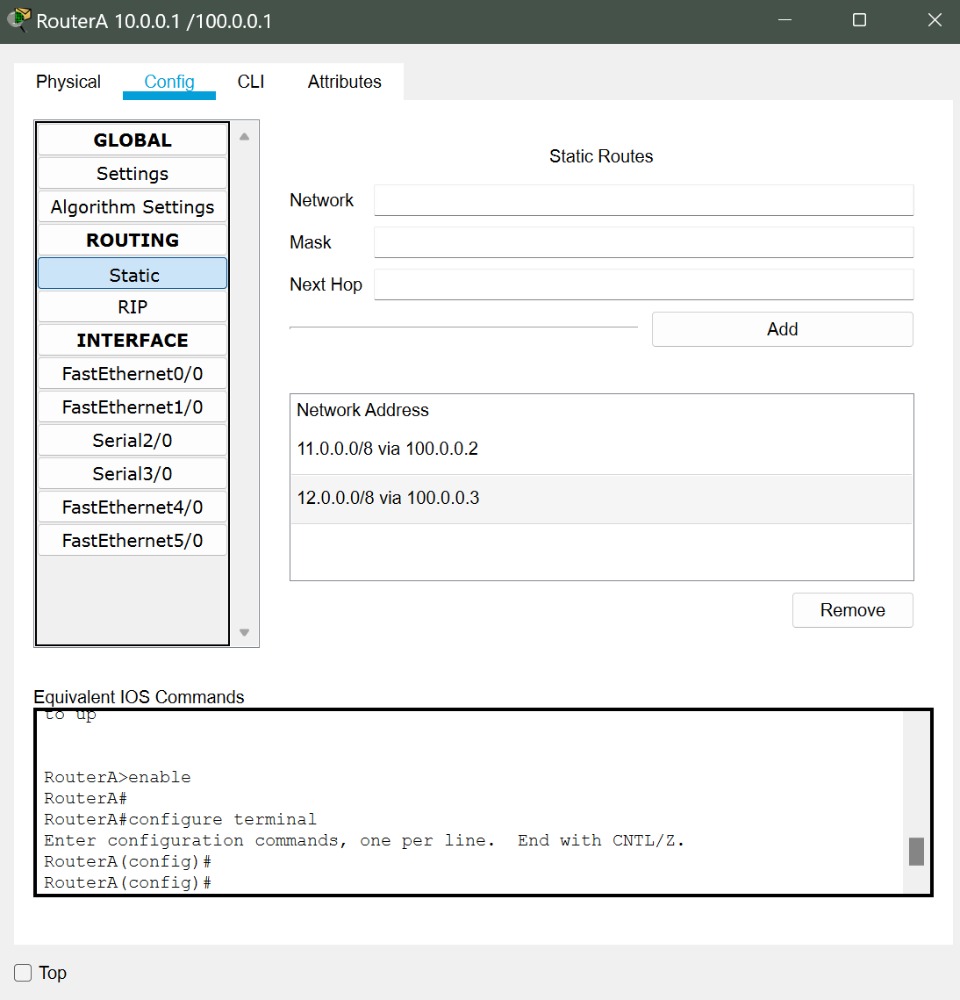

- ## RouterB:
  > 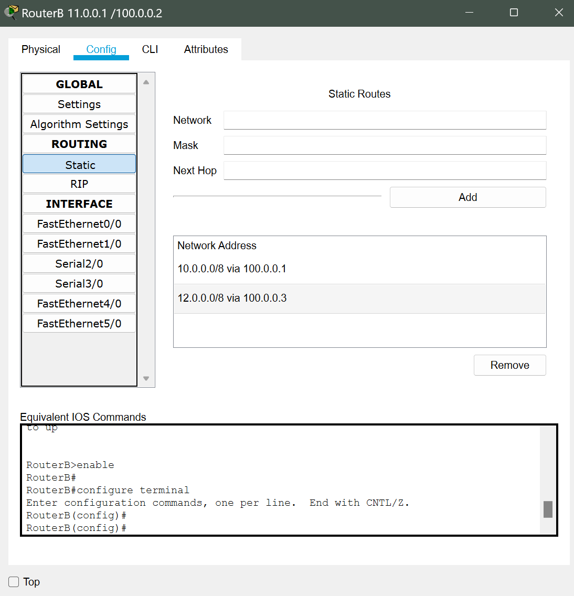

- ## RouterC:
  > 

---
# DHCP Server - Service:
> 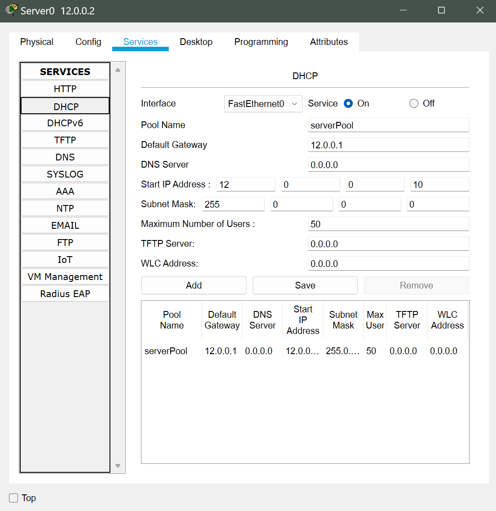

---
# Ping - Test:
  > 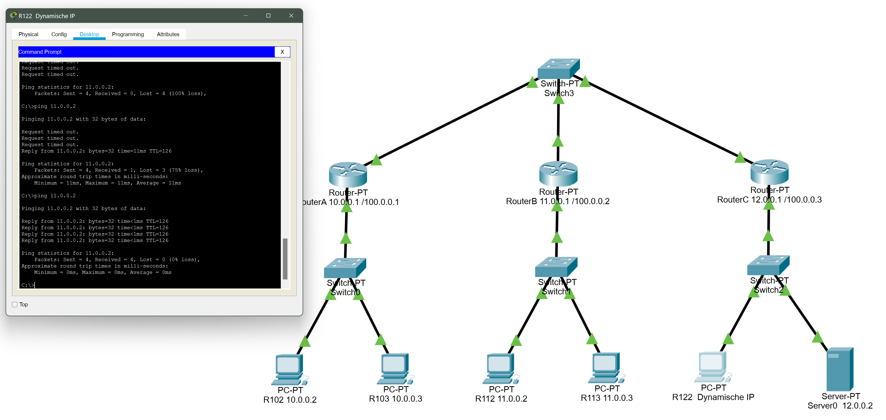

